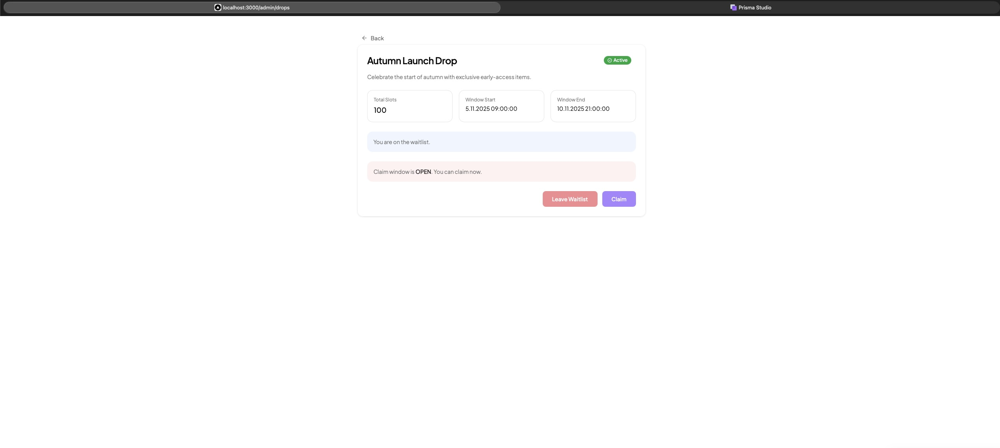
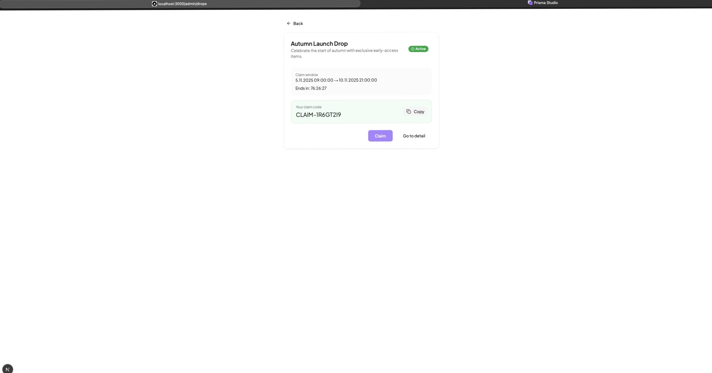
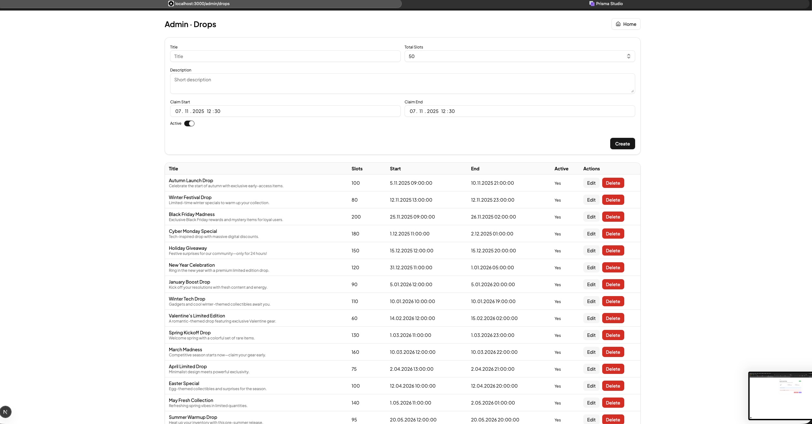

# DropSpot — Full-Stack Case

**Project Start Time: 2025-11-04 18:00**
**Please see the end of this README file for screenshots**

Full-stack case project for Alpaco — limited-stock and waitlist platform built with Express, Prisma, PostgreSQL, and Next.js.

**⚙️ Backend Setup**
If you want to recreate the backend setup from scratch:  
```
# 1. Initialize a new Node.js project
mkdir backend && cd backend
npm init -y

# 2. Install core dependencies
npm install express
npm install dotenv cors helmet

# 3. Add TypeScript and types
npm install -D typescript ts-node-dev @types/node @types/express

# 4. Initialize TypeScript config
npx tsc --init

# 5. Add Prisma ORM
npm install prisma @prisma/client
npx prisma init

# 6. Create project structure
mkdir src src/config src/controllers src/services src/middlewares src/routes src/utils
touch src/app.ts src/server.ts
```


**📦 Data Model & Rationale**

**🐳 Local Development Environment**

The project runs PostgreSQL 17 in a Docker container for consistency across environments.
A minimal docker-compose.yml file provisions the database service with mounted volumes for persistent data:
```
services:
  postgres:
    image: postgres:17
    container_name: dropspot-db
    environment:
      POSTGRES_USER: dropspot_user
      POSTGRES_PASSWORD: dropspot_pass
      POSTGRES_DB: dropspot_db
    ports:
      - "5432:5432"
    volumes:
      - ./pgdata:/var/lib/postgresql/data
```
This setup allows easy database resets and ensures the same PostgreSQL version is used in all local and CI environments.
You can start the DB with:
```
docker compose up -d
```

We model the drop flow with four core entities, plus Session for refresh-token auth:
•	User — minimal auth footprint (email unique, passwordHash, role).  
•	Drop — a limited-slots campaign with a claim window (claimWindowStart/End, totalSlots, isActive).  
•	Waitlist — a user’s intent to join a given drop (userId,dropId,priorityScore,joinedAt).  
•	Claim — a granted, single-use code for a user and a drop (code unique, status, issuedAt, usedAt?).  
•	Session — stateful refresh-token store (hashed), with revoke/expiry fields.  

All timestamps are stored as UTC (timestamptz) for portability; UI is responsible for localization.  

```
User 1——*   Waitlist  *——1 Drop
User 1——*   Claim     *——1 Drop
User 1——*   Session
```
	•Waitlist: unique (userId,dropId) → a user joins a drop at most once.
	•Claim: unique (userId,dropId) and code unique → one claim per user per drop; code is globally unique.
	•Cascades: deleting a User/Drop cascades to dependent rows (MVP-friendly).

**Indexing Strategies**  
•Drop: isActive, (claimWindowStart, claimWindowEnd), createdAt.  
•Waitlist: userId, (dropId, priorityScore DESC, joinedAt ASC) → deterministic ordering.  
•Claim: userId, dropId, status, issuedAt.  
•Session: userId, expiresAt, (userId, revokedAt) → fast active-session lookups.

**Why no remainingSlots column?**  
To keep the schema simple and correct, remaining capacity is derived at read/claim time:

```
remaining = totalSlots − COUNT(Claim WHERE dropId = X AND status IN (ISSUED, USED))
```
This avoids denormalization bugs though I can still add denormalized remaining field into drops table in case the remaining calculation that we implemented bottlenecks in high traffic and load.
But for the sake of simplicity in limited time (72 hours), I choose to implement simple remaining calculation.

## ⚙️Backend Overview

**Tech Stack**  
•	Runtime: Node.js + TypeScript + Express  
•	DB: PostgreSQL (Prisma ORM)  
•	Cache/Flags: Redis (token blacklist)  
•	Auth: JWT (access) + DB-backed sessions (refresh)  
•	Tests: Vitest  

**Folder Structure**
```
backend/
    src/
    config/        # prisma client, env loader
    controllers/   # HTTP boundary (thin)
    middlewares/   # auth guards, refreshSession
    routes/        # route modules mounted under /drops, /auth, ...
    services/      # business logic (DropService, WaitlistService, ClaimService, AuthService)
    utils/         # helpers (hash, jwt, error, redis client, etc.)
tests/
    unit/          # generateClaimCode.test.ts
    integration/   # claim.flow.test.ts (+ window/edge scenarios)
```

**Packages (Why we use them)**
•	express — minimal HTTP framework.  
•	jsonwebtoken — signs/verifies access & refresh tokens.  
•	cookie-parser — reads HttpOnly refresh cookie safely.  
•	bcrypt / argon2 (whichever you used) — password hashing.  
•	@prisma/client — DB access via Prisma.  
•	ioredis / redis — Redis client for token blacklist.  


### Endpoints and CRUD Operations

### Public (Browse)
| Method | Path        | Description | Notes |
|---|-------------|--|---|---|
| GET | `/drops`    |   List active drops | Query: paging/sort (optional) |
| GET | `/drops:id` | List a | Query: paging/sort (optional) |


#### Public (Browse)
| Method | Path            | Description            | Query (optional)                  | Response (min) |
|-------:|-----------------|------------------------|-----------------------------------|----------------|
| GET    | `/drops`        | List active drops      | `page, limit, sort`               | `Drop[]`       |
| GET    | `/drops/:id`    | Get drop detail        | —                                 | `Drop` (+ user context if authed) |


#### Auth
| Method | Path            | Description        | Body (min)                         | Response (min)                           | Idempotency / Notes                                      |
|-------:|-----------------|--------------------|------------------------------------|-------------------------------------------|----------------------------------------------------------|
| POST   | `/auth/signup`  | Create user        | `{ email, password, name?, isAdmin? }` | `{ accessToken, user }` + HttpOnly refresh cookie | Duplicate email → `409 CONFLICT`                         |
| POST   | `/auth/login`   | Login              | `{ email, password }`              | `{ accessToken, user }` + HttpOnly refresh cookie | Wrong credentials → `401 UNAUTHORIZED`                   |
| POST   | `/auth/logout`  | Logout session     | —                                  | `204 No Content`                          | Access token blacklisted, refresh session revoked        |
| POST   | `/auth/refresh` | Rotate tokens      | — (HttpOnly refresh cookie)        | `{ accessToken }`                          | Revoked/expired session → `401 UNAUTHORIZED`             |


#### Admin — Drop CRUD
| Method | Path                 | Auth     | Description     | Body (min)                                                              | Response (min) | Notes                                      |
|-------:|----------------------|----------|-----------------|-------------------------------------------------------------------------|----------------|--------------------------------------------|
| GET    | `/admin/drops`       | ✅ Admin | List all drops  | —                                                                       | `Drop[]`       |                                            |
| POST   | `/admin/drops`       | ✅ Admin | Create drop     | `{ title, description?, totalSlots, claimWindowStart, claimWindowEnd, isActive }` | `Drop`         | Validates window range                      |
| PATCH  | `/admin/drops/:id`   | ✅ Admin | Update drop     | Any subset of create fields                                             | `Drop`         | Keeps invariants (window range, slots)     |
| DELETE | `/admin/drops/:id`   | ✅ Admin | Delete drop     | —                                                                       | `204 No Content` | Cascades to dependent rows (claims/waitlists) |


#### Waitlist
| Method | Path               | Description       | Body | Response (min)                          | Idempotency / Notes                                             |
|-------:|--------------------|-------------------|------|-----------------------------------------|-----------------------------------------------------------------|
| POST   | `/drops/:id/join`  | Join waitlist     | —    | `200 OK` (`{ joined: true, priorityScore }` optional) | `@@unique([userId, dropId])` → safe to repeat (no duplicates)   |
| POST   | `/drops/:id/leave` | Leave waitlist    | —    | `204 No Content`                         | Not joined → `409 NOT_IN_WAITLIST`; has claim → `409 HAS_CLAIM` |


#### Claim
| Method | Path                 | Description            | Body | Response (min)                         | Idempotency / Notes                                                                 |
|-------:|----------------------|------------------------|------|----------------------------------------|-------------------------------------------------------------------------------------|
| POST   | `/drops/:id/claim`   | Claim within window    | —    | `200 { code, status: "ISSUED", issuedAt }` | **Idempotent**: if user already has a claim, returns the **same code** with `alreadyHad: true`. Window closed / not in waitlist / sold out (for new claims) → `409`. |
| GET    | `/drops/:id/claim-status` *(optional)* | Check if user has claim | —    | `200 { hasClaim: boolean }`            | Lightweight probe for UI; does **not** create a claim                                |

### Architecture and Logic Breakdown

**Controller–Service **
•	Controllers: parse input, call a single service method, shape the HTTP response.  
•	Services: all business logic (transactions, locks, domain rules) live here.  
•	Why: testability, clear boundaries, and easier refactors.  


**Auth model (Short-lived access + long-lived refresh)**
•	Access token (JWT): short TTL (15m), carried via Authorization: Bearer.  
•	Refresh token: stored as HttpOnly cookie (not JS-accessible), persisted as hash in Session table with expiresAt.  
•	Why: defense-in-depth. Compromise of access token is short-lived; refresh is revocable by server side (DB row).  


**Refresh flow (auto, middleware)**
•	refreshSession middleware: on each protected request,  
•	verifies access token; if expired, and a valid refresh cookie/session exists → rotates tokens and injects the new access token into the same request so the pipeline continues without failing.  
•	Why: zero UX friction for clients and keeps handlers clean.  


**Logout & token revocation**
•	Access token blacklist (Redis): on logout we SETEX bl:<jti> = 1 until token exp.  
•	requireAuth checks Redis first
•	Refresh revoke: mark session (DB) as revoked or delete row; cookie cleared.  
•	Why: instant kill-switch for stolen tokens. 


### Consistency, Transactions & Idempotency

#### Why are Waitlist join and Claim inside a transaction?
- **Atomicity**: Either all checks + writes succeed, or none do. This prevents partial states such as a user being added to the waitlist but failing during priority calculation or claim creation.
- **Consistency**: Priority ordering, capacity checks, and window validation are evaluated against a single consistent snapshot.
- **Race-safety**: Multiple users acting at the same time (e.g., last slot) cannot interleave steps and oversell.


**Why do we lock the `Drop` row during Claim?**
- **Capacity is owned by Drop**: The invariant is `usedCount(dropId) < totalSlots`. By acquiring a row lock on the specific Drop (`SELECT ... FOR UPDATE` via Prisma transaction) we **serialize** competing claims for that Drop.
- **Prevents oversell**: Two requests cannot both observe the same remaining capacity and both insert a Claim; one observes the committed state of the other.
- **Minimal lock footprint**: We lock only the relevant `Drop` row (not the whole table and not the entire waitlist) to keep contention low under load.


**What exactly runs inside the Claim transaction?**
1. Lock `Drop` row.
2. Validate claim window (`start <= now <= end`) and `isActive`.
3. Ensure user is on the waitlist.
4. Compute `usedCount` and derive `remaining = totalSlots - usedCount`.
5. Enforce **eligibility** (priority order with deterministic tiebreakers).
6. Insert Claim (or detect existing one) and return the code.


**Waitlist join invariants (in a transaction)**
- Enforce `@@unique([userId, dropId])` and compute `priorityScore` exactly once.
- The join is idempotent by design: repeating the same request won’t create duplicates.


**Idempotency strategies used**
- **Database-level uniqueness**
    - `Waitlist`: `@@unique([userId, dropId])` → the same user cannot join twice.
    - `Claim`: `@@unique([userId, dropId])` and `code @unique` → at most one claim per user per drop; code is globally unique.
    - `Session`: `@unique(refreshTokenHash)` → each refresh token is unique.
- **Application-level upsert / detect & map**
    - Waitlist join: safe to retry; duplicate attempts resolve to the same row (conflict maps to a stable 200/409 depending on API choice).
    - Claim: if the user already has a claim, we map to `409 ALREADY_CLAIMED` instead of creating a second one (making the operation **safe to retry**).
- **Token revocation idempotency**
    - Logout blacklists the current access token (`SETEX bl:<jti>`). Repeating logout is harmless (key already present or expired) → still a success (returns 204).


---

## Seed String & Priority Coefficients

This project derives a deterministic seed to make the **priority score** stable and auditable while still being unpredictable across different repositories.

### 1) Build the seed string (config/seed.ts)
We concatenate three immutable project facts in a fixed order:

- **PROJECT_START_DATE** – ISO string of when this case project started (e.g., `2025-11-04T18:00:00Z`).
- **GITHUB_REMOTE_URL** – `<owner>/<repo>` (e.g., `https://github.com/firatkocoglu/dropspot`).
- **FIRST_COMMIT_EPOCH** – Epoch timestamp of the first commit (e.g., `1762268549`)..

Seed string format:
```
seedString = `${GITHUB_REPO_NAME}|${FIRST_COMMIT_DATE}|${PROJECT_START_DATE}`
```

Example implementation:
```ts
// config/seed.ts
import { sha256 } from "@/utils/hash";

const PROJECT_START_TIME = "202511041800"
const GITHUB_REMOTE_URL = "https://github.com/firatkocoglu/dropspot"
const FIRST_COMMIT_EPOCH = "1762268549"

const seedString = `${GITHUB_REMOTE_URL}|${FIRST_COMMIT_EPOCH}|${PROJECT_START_DATE}`;
const hashedSeed = sha256(seedString)
return hashedSeed.substring(0, 12)
```

> **Why these fields?** They are stable for the lifetime of the project and uniquely identify the repository instance.

### 2) Derive A, B, C coefficients (utils/seed.ts)
From `PROJECT_SEED` we compute small, bounded coefficients used by the priority formula. The method is deterministic but repo‑specific.

```ts
// utils/seed.ts
export function generateCoefficientsFromSeed (seed: string) {
    const A = 7 + (parseInt(seed.substring(0, 2), 16) % 5) // coefficient of account age
    const B = 13 + (parseInt(seed.substring(2, 4), 16) % 7) // coefficient of join order to waitlist
    const C = 3 + (parseInt(seed.substring(4, 6), 16) % 3) // penalty coefficient for joining many waitlists (number of waitlists the user joined)

    return {A, B, C}
}
```

### 3) Where we use them
When a user joins a waitlist we compute and persist:
```
priorityScore = (A % userOrder) + (B % accountAgeDays) - (C % totalWaitlistsJoined)
```
- `userOrder` starts at **1** (not 0), so very new accounts aren’t penalized by a zero divisor.
- The score is written once at join time and used for deterministic ordering:
  `orderBy [priorityScore DESC, joinedAt ASC, id ASC]`.

> This keeps the system fair and reproducible (no lotteries), while still preventing simple gaming strategies (e.g., mass‑joining many waitlists).

---

## 🖥️ Frontend Overview

**Tech Stack**  
• Framework: **Next.js 15 (App Router)**  
• Language: **TypeScript + React 19**  
• UI Library: **shadcn/ui + TailwindCSS + Sonner**  
• State / Server sync: **TanStack Query (React Query)**  
• Tests: **Vitest + React Testing Library (RTL)**

---

### 🧱 Architecture
```
frontend/
├── src/
│   ├── app/               # Next.js app router structure
│   │   ├── drops/         # Drop list & detail pages
│   │   ├── login/         # Login page
│   │   ├── signup/        # Signup page
│   │   ├── admin/         # Admin dashboard
│   │   └── layout.tsx     # Global layout (Sonner + QueryClientProvider)
│   ├── components/        # UI components (DropCard, Buttons, etc.)
│   ├── lib/               # API client (axios wrapper) + types
│   ├── test/              # test setup + mocks
│   └── styles/            # Tailwind configuration
```
**Key Concepts**
- **App Router + Server Components:** Static and dynamic routes (`/drops/[id]`) built using Next.js 15.
- **Client Components:** Interactive parts (`DropCard`, `ClaimPage`) marked with `"use client"`.
- **TanStack Query:** Handles caching, mutations, and background refetching.
- **UI Kit:** `shadcn/ui` for accessible components; `Sonner` for toast notifications.
- **Auth Flow:** Access token in `localStorage`; redirect to `/login` if missing.
- **Error & Loading States:** Lightweight placeholders for better UX.

---

### ✨ Features Implemented

✅ **Drop list** — Fetches `/drops` and renders cards with “View details.”  
✅ **Drop detail** — Shows slot info, waitlist join/leave, and claim actions.  
✅ **Claim flow** — Displays the returned code; idempotent (same code always returned).  
✅ **Admin panel** — CRUD for drops with inline edit/delete.  
✅ **Auth system** — Login, signup (with `Register as Admin` checkbox), logout.  
✅ **Responsive UI** — TailwindCSS-based design.

---

### 🧪 Frontend Tests

**Test Runner:** Vitest + RTL  
**Setup:** `src/test/setupTests.tsx` (mocks `next/navigation`, provides `QueryClientProvider`).

| File | Scope | What It Tests |
|------|--------|---------------|
| `ClaimPage.idempotency.test.tsx` | Claim flow | Multiple clicks → same code (idempotent). |
| `ClaimPage.status.test.tsx` | Claim flow | Shows correct text: **“Ends in:”** (open) and **“Starts in:”** (before window). |

**Notes**
- Mocked API via `__mocks__/apiClient.ts`.
- Run with `npm run test`.

---

### ⚙️ Environment Variables

`.env.local` in `frontend/`: NEXT_PUBLIC_API_URL=http://localhost:3001  

---

### 🚀 Run the Frontend

```
cd frontend
npm install
npm run dev

Open http://localhost:3000
```


## 📸 Screenshots

**Login**


**Drop List**


**Drop Detail**



**Claim Page**



**Admin Panel**



